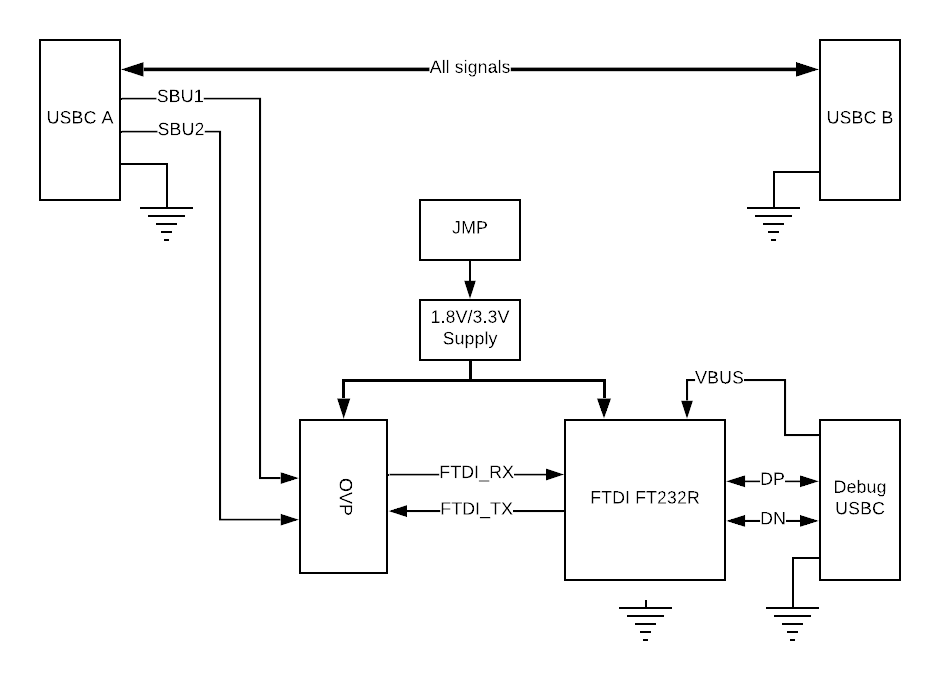

# USB-Cereal

USB-Cereal is a debugging and development tool for designs that use USB-C port and bring out serial TX/RX lines into SBU1/2 pins. USB-Cereal is made compatible with both 1.8V and 3.3V signalling.

A few important things to note:

* **USB-Cereal is not an officially supported Google product.**

* **USB-Cereal will not work as a USB-C hub/splitter. It is a development tool.**

* **USB-Cereal device is not USB-C spec compliant tool. It will not work with and might damage target devices that hasn't been designed to work with USB-Cereal. Please use with caution and at your own risk.**

Please read getting started before plugging in the device. If used without caution, both USB-Cereal and target device could be damaged.

# Getting Started
1. Determine correct serial signalling level on the target device - 1.8V or 3.3V. Incorrect voltage setting might permanently damage your device!
2. Determine correct orientation - top vs. bottom - the tool operates correctly only when SBU1 pin corresponds to TX and SBU2 pin corresponds to RX.
3. Serial log capture - please install ftdi232r [drivers](https://www.ftdichip.com/Drivers/VCP.htm). Use your favorite serial monitoring console on the PC.

# Avoid Damaging Target Device
USB-Cereal can operate both with 1.8V and 3.3V logic level systems. The transition from 1.8V to 3.3V is NOT automatic and is done via on-board DIP switch. **Incorrect logic level setting might cause target device or USB-Cereal failure and/or permanent damage. If unsure of target device logic levels used, always start with 1.8V to avoid damaging the target device.** USB-Cereal implements overvoltage clamp transistors, and is unlikely to get damaged from small overvoltage events.

# Source Files
1. Schematic diagram + board layout (Altium)
2. Enclosure (STLs, STEP file exported from Autocad Fusion 360)
3. No firmware/programming is required

# License
This project is licensed under the Apache v2.0 License - see the [LICENSE.md](LICENSE.md) file for details

# Contributing
Thank you for your interest - please review CONTRIBUTING.md!
